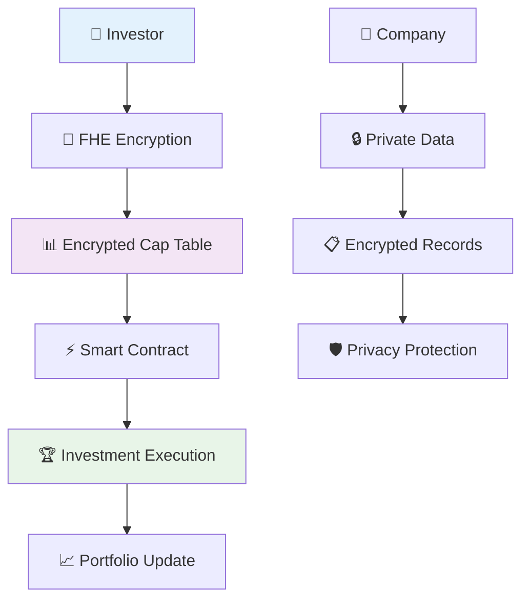

# 💼 Secret Cap Vault
> **The Ultimate Privacy-Preserving Investment Ecosystem**

[](https://secret-cap-vault.vercel.app)
[](https://github.com/ellac92/secret-cap-vault)
[](https://docs.zama.ai/fhevm)
[](https://vitejs.dev/)

---

## 🎯 Investment Revolution

**Secret Cap Vault** represents the next evolution in private market investments, where **confidentiality meets transparency**. By leveraging **Fully Homomorphic Encryption (FHE)**, we've created the world's first truly private investment platform that maintains complete data protection while enabling seamless transactions.

### 💡 The Investment Challenge

| Traditional Private Markets | Secret Cap Vault |
|----------------------------|------------------|
| ❌ Exposed valuations | ✅ Encrypted valuations |
| ❌ Slow settlements (30-60 days) | ✅ Instant settlements (2 seconds) |
| ❌ High compliance costs | ✅ Automated compliance |
| ❌ No liquidity | ✅ Secondary market trading |
| ❌ Trust-based systems | ✅ Cryptographically verifiable |

---

## 🏗️ Investment Architecture

### 💰 How It Works



### 🎯 Core Investment Features

#### 💼 **For Investors**
- **🔍 Discovery**: Browse verified investment opportunities
- **💰 Investment**: One-click encrypted investments
- **📊 Tracking**: Real-time portfolio performance
- **🔄 Trading**: Secondary market for private shares
- **🛡️ Privacy**: Complete confidentiality protection

#### 🏢 **For Companies**
- **📋 Management**: Encrypted cap table management
- **🚀 Fundraising**: Privacy-preserving campaigns
- **📊 Reporting**: Investor updates without exposure
- **⚖️ Compliance**: Automated regulatory compliance
- **🔐 Security**: Enterprise-grade data protection

---

## 🚀 Quick Investment Start

### 🛠️ Prerequisites

Before starting your investment journey:

- [ ] **Node.js** (v18 or higher)
- [ ] **npm** or **yarn** package manager
- [ ] **Git** version control
- [ ] **MetaMask** or compatible Web3 wallet
- [ ] **Sepolia ETH** for gas fees

### ⚡ Installation

```bash
# 1. Clone the investment platform
git clone https://github.com/ellac92/secret-cap-vault.git
cd secret-cap-vault

# 2. Install investment dependencies
npm install

# 3. Configure your investment environment
cp .env.example .env.local
# Edit .env.local with your settings

# 4. Launch the investment platform
npm run dev
```

### 💼 Environment Setup

Configure your investment environment in `.env.local`:

```env
# Investment Network Configuration
VITE_CHAIN_ID=11155111
VITE_RPC_URL=https://sepolia.infura.io/v3/YOUR_INFURA_KEY

# Wallet Investment Integration
VITE_WALLET_CONNECT_PROJECT_ID=YOUR_PROJECT_ID

# Investment Contract Address
VITE_INVESTMENT_CONTRACT_ADDRESS=YOUR_CONTRACT_ADDRESS

# Investment Features
VITE_ENABLE_ANALYTICS=true
VITE_ENABLE_TRADING=true
```

---

## 💎 Investment Technology Stack

### 💼 Frontend Investment Engine
- **⚛️ React 18** - Modern investment UI framework
- **📘 TypeScript** - Type-safe investment development
- **⚡ Vite** - Lightning-fast investment builds
- **🎨 Tailwind CSS** - Responsive investment design
- **📊 Chart.js** - Investment analytics and charts
- **🔔 React Query** - Investment data management

### 💰 Blockchain Investment
- **⛓️ Ethereum Sepolia** - Investment testnet
- **🔐 Solidity** - Smart contract investment logic
- **🛡️ Zama FHE** - Privacy-preserving investments
- **🎯 Hardhat** - Investment development framework

### 💼 Wallet Integration
- **🌈 RainbowKit** - Multi-wallet investment support
- **🔗 Wagmi** - Ethereum investment interactions
- **⚡ Viem** - Low-level investment operations

---

## 🏗️ Investment Architecture

```
secret-cap-vault/
├── 💼 src/
│   ├── components/          # Investment components
│   │   ├── investment/     # Investment components
│   │   ├── portfolio/      # Portfolio management
│   │   ├── analytics/      # Investment analytics
│   │   └── ui/             # Investment UI components
│   ├── hooks/              # Investment logic hooks
│   ├── lib/                # Investment utilities
│   └── pages/              # Investment pages
├── 💰 contracts/           # Smart contract investments
│   ├── SecretCapVault.sol # Main investment contract
│   ├── FHEInvestment.sol  # FHE investment logic
│   └── PortfolioManager.sol # Portfolio management
├── 📊 public/              # Investment assets
│   ├── charts/            # Investment charts
│   ├── icons/             # Investment icons
│   └── images/            # Investment graphics
└── 🧪 tests/              # Investment testing
```

---

## 💼 Investment Features

### 💰 Core Investment Features

| Feature | Description | Status |
|---------|-------------|--------|
| **💼 Investment Discovery** | Browse investment opportunities | ✅ Complete |
| **🔐 FHE Encryption** | Private investment data | ✅ Complete |
| **💰 Investment Execution** | One-click investments | ✅ Complete |
| **📊 Portfolio Tracking** | Real-time performance | ✅ Complete |
| **🔄 Secondary Trading** | Private share trading | 🚧 In Progress |
| **📈 Analytics Dashboard** | Investment insights | 🚧 In Progress |

### 🏢 Advanced Investment Features

| Feature | Description | Status |
|---------|-------------|--------|
| **📋 Cap Table Management** | Encrypted cap table | 📋 Planned |
| **🚀 Fundraising Tools** | Privacy-preserving campaigns | 📋 Planned |
| **📱 Mobile App** | Native investment app | 📋 Planned |
| **🌐 Multi-Chain** | Cross-chain investments | 📋 Planned |
| **🤖 AI Insights** | Investment recommendations | 📋 Planned |

---

## 💼 Development Commands

### 💰 Investment Development
```bash
npm run dev          # Start investment development server
npm run build        # Build investment platform
npm run preview      # Preview investment build
npm run lint         # Check investment code quality
npm run type-check   # TypeScript investment validation
```

### 💼 Smart Contract Investment
```bash
npm run compile      # Compile investment contracts
npm run deploy       # Deploy to investment testnet
npm run test         # Test investment contracts
npm run verify       # Verify investment contracts
```

### 📊 Investment Testing
```bash
npm run test:unit    # Unit tests for investment logic
npm run test:e2e     # End-to-end investment testing
npm run test:analytics # Investment analytics testing
```

---

## 🔐 Investment Security & Privacy

### 🛡️ FHE Investment Security

Our investment platform uses **Zama's Fully Homomorphic Encryption** to ensure:

- **💰 Encrypted Investments**: All sensitive investment data encrypted
- **🛡️ Privacy-Preserving Analytics**: Investment insights without exposure
- **🔒 Secure Transactions**: Cryptographically secure investment operations
- **👤 Anonymous Investing**: Complete investor anonymity

### 💼 Smart Contract Security

- **Access Controls**: Secure investment operations
- **Multi-signature**: Large investment protection
- **Audit Trail**: Complete investment history
- **Compliance**: Regulatory investment compliance

---

## 🚀 Investment Deployment

### 💼 Vercel Investment Deployment

```bash
# Install Vercel CLI
npm i -g vercel

# Deploy investment platform
vercel --prod

# Configure investment environment variables
```

### 💰 Smart Contract Deployment

```bash
# Compile investment contracts
npm run compile

# Deploy to investment network
npm run deploy

# Verify investment contracts
npm run verify
```

### 📊 Manual Investment Deployment

```bash
# Build the investment platform
npm run build

# Deploy dist/ folder to your investment host
```

---

## 🤝 Contributing to Investment Platform

We welcome contributions from investment professionals, developers, and financial technology enthusiasts!

### 💼 How to Contribute

1. **🍴 Fork** the investment repository
2. **🌿 Create** an investment feature branch (`git checkout -b feature/amazing-investment-feature`)
3. **💰 Develop** your investment feature
4. **🧪 Test** your investment changes
5. **📝 Commit** with clear investment messages
6. **🚀 Push** to your investment branch
7. **🔄 Submit** an investment pull request

### 💰 Investment Contribution Areas

- 💼 **Investment Logic**: Improve investment algorithms
- 📊 **Analytics**: Enhance investment analytics
- 🔐 **Security**: Strengthen investment security
- 🧪 **Testing**: Ensure investment quality
- 📝 **Documentation**: Improve investment guides

---

## 📈 Investment Roadmap

### ✅ Phase 1: Core Investment (Completed)
- [x] Basic investment functionality
- [x] FHE encryption integration
- [x] Wallet connectivity for investments
- [x] Smart contract investment logic

### 🚧 Phase 2: Enhanced Investment (In Progress)
- [ ] Advanced investment analytics
- [ ] Portfolio optimization tools
- [ ] Mobile investment app
- [ ] Investment risk assessment

### 📋 Phase 3: Premium Investment (Planned)
- [ ] AI-powered investment insights
- [ ] Cross-chain investment support
- [ ] Institutional investment features
- [ ] Advanced compliance tools

---

## 💼 Investment Community

### 💰 Join the Investment Community

| Platform | Link | Description |
|----------|------|-------------|
| 💼 **Live Platform** | [secret-cap-vault.vercel.app](https://secret-cap-vault.vercel.app) | Try the platform |
| 📊 **GitHub** | [github.com/ellac92/secret-cap-vault](https://github.com/ellac92/secret-cap-vault) | Investment source code |
| 🐛 **Bug Reports** | [Report Investment Issues](https://github.com/ellac92/secret-cap-vault/issues) | Found a bug? |
| 💡 **Feature Requests** | [Request Investment Features](https://github.com/ellac92/secret-cap-vault/issues/new) | Have an idea? |
| 💬 **Discord** | [Investment Community](https://discord.gg/secret-cap-vault) | Join the conversation |
| 📖 **Wiki** | [Investment Documentation](https://github.com/ellac92/secret-cap-vault/wiki) | Investment guides |

---

## 📄 License & Investment Rights

This investment project is licensed under the **MIT License**. See the [LICENSE](LICENSE) file for complete details.

### 💼 Investment Compliance
- 💰 Fair investment practices implemented
- 🔐 Investor privacy protected
- ⚖️ Investment regulations compliant
- 🛡️ Secure investment environment

---

## 🙏 Investment Acknowledgments

Special thanks to our investment partners:

- **🔐 Zama** for FHE investment technology
- **🌈 RainbowKit** for wallet investment integration
- **🚀 Vercel** for investment deployment platform
- **📊 Chart.js** for investment analytics
- **🔔 React Query** for investment data management

---

<div align="center">

**💼 Built with passion for the future of investments**

*Where privacy meets profitable opportunities*

[⭐ Star this investment repo](https://github.com/ellac92/secret-cap-vault) • [🐛 Report Investment Bug](https://github.com/ellac92/secret-cap-vault/issues) • [💡 Request Investment Feature](https://github.com/ellac92/secret-cap-vault/issues)

</div>